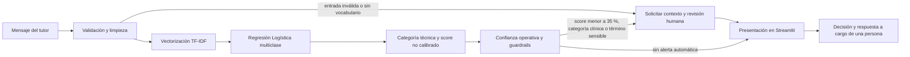

# Arquitectura del prototipo Cat Clinic UIO

## Objetivo y límite del sistema

El prototipo clasifica la intención comunicacional de un mensaje individual y
presenta una sugerencia para revisión humana. No reconstruye conversaciones,
no diagnostica, no prescribe, no asigna gravedad o prioridad clínica y no
genera ni envía respuestas automáticas.

## Flujo de extremo a extremo

## Componentes

| Componente | Entrada | Función | Salida |
|---|---|---|---|
| `CatClinic_MVP_Seguro/app.py` | Texto ingresado en Streamlit | Carga artefactos, coordina la interfaz y presenta el resultado | Categoría visible o resultado no concluyente, score, alertas e historial de sesión |
| `CatClinic_MVP_Seguro/safety.py` | Mensaje, modelo y vectorizador | Limpia el texto, valida la entrada, ejecuta la predicción y aplica controles conservadores | `ResultadoClasificacion` con estado, categoría, score y motivos de revisión |
| `tfidf_vectorizer.pkl` | Texto limpio | Transforma unigramas y bigramas en 4.295 características TF-IDF | Vector disperso |
| `modelo_clasificador.pkl` | Vector TF-IDF | Ejecuta Regresión Logística multiclase con 12 categorías | Categoría y distribución estimada |
| Streamlit | Resultado estructurado | Muestra la salida y conserva un historial temporal durante la sesión | Información revisable por el personal |

Los artefactos fueron serializados con scikit-learn 1.6.1. El vectorizador usa
unigramas y bigramas; el clasificador usa `class_weight="balanced"` y el
solver `lbfgs`. Estos parámetros se verificaron en los archivos versionados,
pero el repositorio no contiene todavía el pipeline de entrenamiento necesario
para demostrar su correspondencia exacta con el corpus y las métricas del
documento final.

## Validaciones y guardrails

La entrada se convierte a minúsculas, elimina URL, caracteres no alfabéticos y
espacios repetidos. Si queda vacía o el vector TF-IDF no reconoce términos, el
sistema no clasifica. Para entradas clasificables se solicita revisión humana
cuando ocurre al menos una de estas condiciones:

- score estimado menor a 35 %;
- categoría técnica clínica;
- presencia de términos sensibles definidos en `safety.py`;
- ausencia de un score estimado.

Un score bajo se presenta como **Clasificación no concluyente**; la categoría
técnica permanece oculta en un detalle de auditoría. El score procede de
`predict_proba`, no está calibrado y no equivale a certeza clínica.

## Entradas, salidas y persistencia

- **Entrada:** hasta 5.000 caracteres escritos o pegados por una persona.
- **Salida principal:** categoría sugerida o resultado no concluyente, alertas
  y motivos de revisión.
- **Salida técnica:** distribución estimada por categoría para auditoría.
- **Persistencia:** el historial existe únicamente en el estado de la sesión de
  Streamlit; este repositorio no implementa base de datos, envío de mensajes ni
  integración con WhatsApp o un CRM.

## Límites de seguridad y operación

La detección de palabras sensibles es una regla conservadora y no una escala de
triaje. Puede omitir expresiones relevantes o activar alertas innecesarias. El
modelo procesa mensajes aislados, puede degradarse ante errores ortográficos,
variantes lingüísticas, múltiples intenciones y entradas fuera de dominio, y
no ha demostrado generalización fuera del corpus académico de una clínica
felina de Quito. Toda acción posterior depende de revisión humana.

## Despliegue

La demo pública ejecuta `CatClinic_MVP_Seguro/app.py` en Streamlit Community
Cloud: <https://catclinic-uio-mvp-seguro-js.streamlit.app>. La accesibilidad de
la demo no implica que el repositorio tenga la misma visibilidad.

## Evidencia relacionada

- [Validación técnica](../CatClinic_MVP_Seguro/VALIDACION.md)
- [Tarjeta del modelo](../MODEL_CARD.md)
- [Resultados reportados](../results/README.md)
- [Pruebas automatizadas](../CatClinic_MVP_Seguro/tests/)
- [Casos de guardrails](../CatClinic_MVP_Seguro/evidencia_guardrails.csv)
